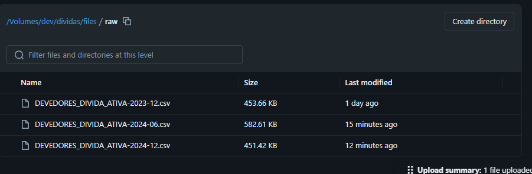

# dividas_ativas

Pipeline DLT responsável por ingerir, tratar e disponibilizar dados de **Devedores da Dívida Ativa** no Lakehouse da Databricks.  
Os dados processados são **públicos**, disponibilizados pelo Banco Central, por exemplo:  
https://www.bcb.gov.br/conteudo/dadosabertos/BCBPGBCB/DEVEDORES_DIVIDA_ATIVA-2025-06.csv

---

## Visão geral do pipeline

---

## Estrutura do Projeto

### **configuration/**
Scripts de preparação e validação do ambiente.

### **explorations/**
Notebooks e consultas auxiliares para análise dos dados processados.

### **src/img/**
Imagens utilizadas na documentação.

- Estrutura da pasta Raw utilizada no streaming:  
  

- Visualização de arquivos ingeridos pelo Auto Loader:  
  

### **transformations/**
Transformações do pipeline Delta Live Tables:

- **`bronze_devedores.sql`**  
  Ingestão contínua via *STREAMING READ FILES* (Auto Loader).

- **`silver_devedores.sql`**  
  Padronização, limpeza e validação dos dados via *STREAMING READ TABLE* (Bronze).

- **`gold_devedores.sql`**  
  Estrutura analítica final consumida por BI, implementada como **Materialized View** (sobre Silver).

- **`audit.sql`**  
  Auditoria automática dos arquivos ingeridos via *STREAMING READ TABLE* (Bronze).

---

## Como funciona

O pipeline segue o fluxo padrão do Lakehouse:

### **Bronze → Silver → Gold**

- **Bronze**  
  Lê os arquivos CSV adicionados ao `UC /Volumes`, anexa metadados e mantém um histórico contínuo.

- **Silver**  
  Normaliza, padroniza e aplica regras de qualidade (Data Quality Expectations).

- **Gold**  
  Estrutura final para consumo analítico, com métricas, colunas derivadas e materialização para performance.

- **Auditoria**  
  Registra arquivos ingeridos, tamanhos, timestamps e demais informações úteis para monitoramento.

---

Este projeto serve como base para ingestão contínua via **Delta Live Tables**, entregando dados confiáveis e prontos para análises, dashboards e integrações operacionais.
